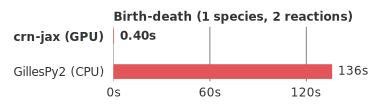
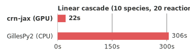

# crn-jax

[](https://github.com/robinhenry/crn-jax/actions/workflows/ci.yml)
[](https://pypi.org/project/crn-jax/)
[](https://pypi.org/project/crn-jax/)
[](LICENSE)
[](https://github.com/astral-sh/ruff)

Chemical reaction networks in JAX — a tiny, GPU-optimized Gillespie / Stochastic Simulation Algorithm (SSA) library.

<p align="center">
  <picture>
    <source media="(prefers-color-scheme: dark)" srcset="benchmarks/figures/throughput_speedup_birth_death_dark.svg">
    <source media="(prefers-color-scheme: light)" srcset="benchmarks/figures/throughput_speedup_birth_death.svg">
    
  </picture>
  &nbsp;
  <picture>
    <source media="(prefers-color-scheme: dark)" srcset="benchmarks/figures/throughput_speedup_linear_cascade_dark.svg">
    <source media="(prefers-color-scheme: light)" srcset="benchmarks/figures/throughput_speedup_linear_cascade.svg">
    
  </picture>
</p>

<p align="center">
  <i>Wall-time to simulate 1,000,000 independent stochastic trajectories — each a full Gillespie run of the reaction network from t=0 to t=20, sampled at 200 time points (CPU vs RTX 5090 GPU).</i>
</p>

## Install

```bash
pip install crn-jax

# with NVIDIA GPU support:
pip install crn-jax "jax[cuda12]"

# with plotting helpers:
pip install "crn-jax[examples]"

# for local development (uses Poetry):
git clone https://github.com/robinhenry/crn-jax && cd crn-jax
poetry install                    # main deps + dev tools
poetry install --with gpu         # add jax[cuda12] on an NVIDIA host
```

`crn-jax` depends on `jax` / `jaxlib` only.

## Key features

- 🎯 **Exact SSA** — pure-JAX implementation of the Gillespie algorithm for chemical reaction networks.
- ⚡ **JIT-compiled** — the entire loop compiles under `jax.jit`.
- 🚀 **GPU speedup** — 1M+ independent trajectories on a single GPU under `jax.vmap`, with no Python overhead.
- ⏱️ **Discretization-safe** — pending reaction times are preserved across simulation-interval boundaries, so trajectories are physically correct under discrete observations (or fixed-interval stepping).
- 🎛️ **Control-input aware** — propensities take an optional `input` argument that can vary per-interval and per-replicate, so each of N parallel trajectories can follow its own control schedule (useful for RL-style rollouts, closed-loop experiments with per-replicate inputs, …).
- 🎨 **Pre-built models** - a library of canonical GRN systems (oscillators, switches, FFLs, …) with easy/hard parameter regimes.
- 🧩 **Bring-your-own state** — the loop operates on any PyTree (NamedTuple, Flax struct dataclass, Equinox module, …).


## Quickstart

A 1-species birth-death process, `∅ → X` at rate λ and `X → ∅` at rate μ·x, simulated for 100 independent replicates:

```python
from typing import NamedTuple
import jax, jax.numpy as jnp
from crn_jax import simulate_trajectory, plot_trajectories

BIRTH_RATE, DEATH_RATE = 3.0, 0.1    # steady-state mean λ/μ = 30

# Define a state-holding object
class State(NamedTuple):
    time: jax.Array
    x: jax.Array
    next_reaction_time: jax.Array    # carried across intervals

# Return propensity equations as an array
# with an optional external input (unused here)
def propensities(s, _input):
    return jnp.array([BIRTH_RATE, DEATH_RATE * s.x])

# Describe how the state changes when reaction `j` fires
def apply_reaction(s, j):
    return s._replace(x=s.x + jnp.where(j == 0, 1.0, -1.0))

# Initial state
state0 = State(jnp.array(0.0), jnp.array(0.0), jnp.array(jnp.inf))

@jax.jit
@jax.vmap
def run_one(key):
    return simulate_trajectory(
        key=key,
        initial_state=state0,
        timestep=1.0,
        n_steps=200,
        # Pass our 2 custom functions defined above
        compute_propensities_fn=propensities,
        apply_reaction_fn=apply_reaction,
    )

# Simulate 100 Gillespie trajectories
states = run_one(jax.random.split(jax.random.PRNGKey(0), 100))
times = jnp.arange(1, 201) * 1.0
```

See the [examples](examples/) folder for more detailed examples.

## Pre-built models

`crn_jax.models` provides a library of canonical GRN reaction networks taken from the literature (see [`library.json`](src/crn_jax/models/library.json) for the full list and parameter sources). Each model module exposes the same surface — `SPECIES`, `Params` with `.easy()` / `.hard()` factory methods, `propensities_fn()`, `apply_reaction()` — and the one-call entry point lives at the package level. Swapping systems in benchmarks is a one-argument change:

```python
import jax, jax.numpy as jnp
from crn_jax import models

# x0 is required and always (n_replicates, n_species): the library does not
# sample initial conditions for you because the sensible IC is problem-specific.
n_rep = 32
key, k_x0 = jax.random.split(jax.random.PRNGKey(0))
x0 = jax.random.uniform(k_x0, (n_rep, len(models.repressilator.SPECIES)),
                        minval=0.0, maxval=100.0)

ds = models.sample_trajectories(models.repressilator, key, x0, n_steps=2000, dt=0.1)

# Every Dataset has the same shape.
ds.species    # ("A", "B", "C")
ds.xs         # (n_replicates, n_steps, n_species) — full trajectories
ds.X_t, ds.dX # (n_replicates * n_steps, n_species) — flat one-step transitions

# Switch regime by passing different Params.
ds_hard = models.sample_trajectories(
    models.repressilator, key, x0, params=models.repressilator.Params.hard(),
    n_steps=2000, dt=0.1,
)
```

The primitives (`propensities_fn()`, `apply_reaction()`) also plug into `simulate_trajectory` directly when the convenience helper isn't enough (custom schedules, per-trajectory dt, …).

| model                  | species   | reactions | shape                                       |
| ---------------------- | --------- | --------- | ------------------------------------------- |
| `birth_death`          | X         | 2         | minimal one-species baseline                |
| `single_gene`          | R, P      | 4         | constitutive transcription-translation      |
| `negative_autoregulation` | X      | 2         | Hill-repressed self-feedback                |
| `positive_autoregulation` | X      | 2         | Hill self-activation (graded; `Params.bistable()` for the bistable regime) |
| `linear_cascade`       | A, B      | 4         | A → B activation cascade                    |
| `toggle_switch`        | A, B      | 4         | mutual repression (Lugagne 2017 *E. coli*)  |
| `incoherent_ffl`       | A, B, C   | 6         | adaptive / pulse-generating FFL             |
| `repressilator`        | A, B, C   | 6         | synthetic oscillator (Elowitz & Leibler 2000) |

## API

```python
# Main entry point: scan n_steps fixed-length intervals, stack the per-step states.
from crn_jax import simulate_trajectory

# Finer control: one interval at a time (RL-style), or until an absolute time.
from crn_jax.gillespie import simulate_interval, simulate_until

# Plotting helper: step-plots a single trajectory or an (N, T) ensemble.
from crn_jax import plot_trajectories

# Optional kinetic-law helpers.
from crn_jax.kinetics import hill_function, sample_lognormal
```

| function              | when to reach for it                                                         |
| --------------------- | ---------------------------------------------------------------------------- |
| `simulate_trajectory` | You want a full trajectory on a fixed sampling grid. Start here.             |
| `simulate_interval`   | You're driving the system yourself, one step at a time (e.g. an RL rollout). |
| `simulate_until`      | You need a custom state shape or a non-uniform time grid. Fully generic.     |
| `plot_trajectories`   | Quick look at the output.                                                    |

## See Also

* [GillesPy2](https://github.com/StochSS/GillesPy2): C++ optimized Gillespie simulations on CPU.
* [jax-smfsb](https://github.com/darrenjw/jax-smfsb): JAX implementations of algorithms from the *Stochastic Modelling for Systems Biology* book.
* [myriad-jax](https://github.com/robinhenry/myriad-jax): RL-style decision making fully in JAX, powered by `grn-jax` at its core.
