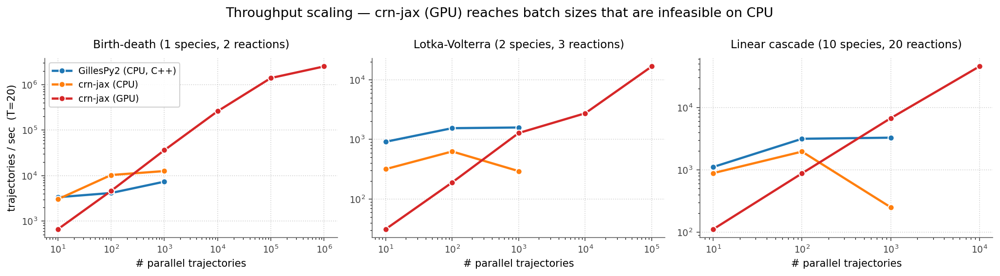
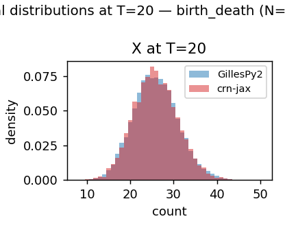
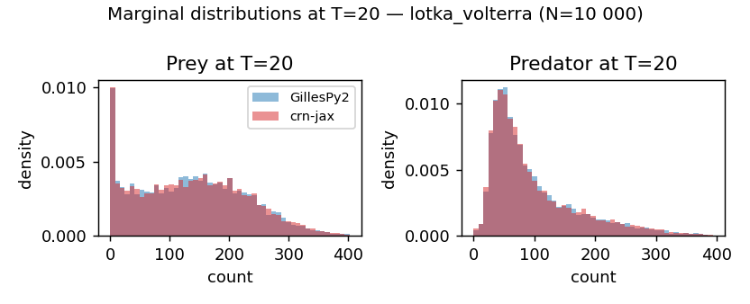
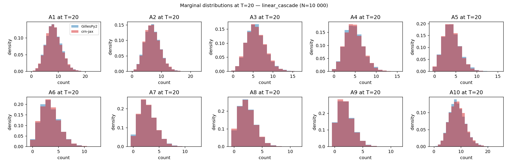
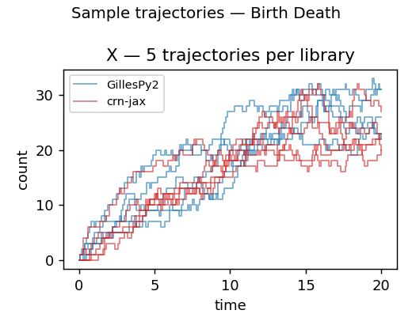
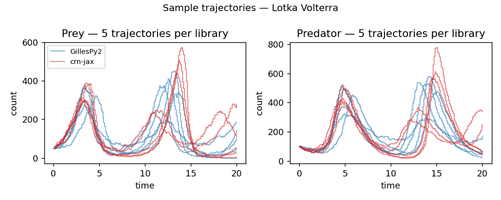
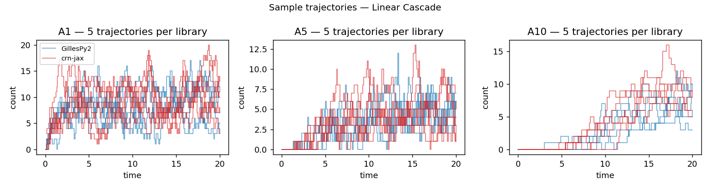

# crn-jax benchmarks

`crn-jax` against [GillesPy2](https://github.com/StochSS/GillesPy2) (the
StochSS reference implementation, with a tightly optimised C++ SSA backend)
on three reaction networks of increasing size.

The two narratives we want to support:

- **(a) faster** — for a fixed batch size you want, crn-jax on GPU runs
  Gillespie simulations 10× to 340× faster than GillesPy2 on CPU.
- **(b) bigger** — crn-jax on GPU comfortably handles batch sizes (1M+
  parallel trajectories) that aren't feasible with GillesPy2 at all.

Self-contained — installs into its own `pyproject.toml`; nothing leaks into
the main library's dependencies.

## Reaction networks

| Model | Species | Reactions | Notes |
|---|---|---|---|
| **birth-death** | 1 | 2 | `∅ → X` at λ=3.0; `X → ∅` at μ·x, μ=0.1. Steady-state X(T) → Poisson(λ/μ). |
| **Lotka-Volterra** | 2 | 3 | Prey reproduction, predation, predator death. Classic SMfSB textbook parameters: c = (1, 0.005, 0.6); x₀ = (50, 100). |
| **linear cascade** | 10 | 20 | `∅ → A₁` at λ=10; `Aᵢ → Aᵢ₊₁` at k·Aᵢ (k=1, i=1..9); `Aᵢ → ∅` at d·Aᵢ (d=0.2, i=1..10). |

T=20, sampling Δt=0.1 (200 observation points) for all models.

## Throughput

### Speedup at peak batch size


Each bar is the peak throughput that combination achieves (for GillesPy2 and
crn-jax CPU that's at modest batch sizes; for crn-jax GPU it's at 1M+
trajectories). On a single NVIDIA RTX 5090, **crn-jax on GPU is 10× to 340×
faster** than GillesPy2's C++ SSA on CPU at peak.

| Model | GillesPy2 CPU peak | crn-jax CPU peak | crn-jax GPU peak | GPU speedup |
|---|---:|---:|---:|---:|
| birth-death     |  7 349 traj/s @ N=1k | 12 557 traj/s @ N=1k | **2.50 M traj/s @ N=1M** | **340×** |
| Lotka-Volterra  |  1 581 traj/s @ N=1k |    628 traj/s @ N=100 |   16.7 k traj/s @ N=100k | **10.5×** |
| linear cascade  |  3 271 traj/s @ N=1k |  1 957 traj/s @ N=100 |   45.4 k traj/s @ N=10k  | **13.9×** |

> On CPU, crn-jax loses to GillesPy2 on the more complex models — JAX's
> per-step overhead is hard to beat against a pure-C++ inner loop. The story
> for crn-jax is GPU; that's where its design pays off.

### Scaling with N



GillesPy2 plateaus near a per-trajectory cost (its sequential C++ loop
benefits from JIT/cache effects but doesn't parallelise across trajectories).
crn-jax on GPU keeps climbing linearly until the GPU is saturated by the
vmap or runs out of memory, reaching 1M trajectories on the simplest
model (where GillesPy2 would need ~136 seconds — crn-jax does it in 0.4 s).

GPU memory ceilings (RTX 5090, 32 GB): birth-death ≈ 1M, LV ≈ 100k,
cascade ≈ 10k. The script catches `RESOURCE_EXHAUSTED` and skips the cell.

## Correctness

For each model we simulate **N=10 000** trajectories with both libraries and
test whether crn-jax samples from the same distribution as GillesPy2 (the
reference) using a **two-sample Kolmogorov-Smirnov test** at α=0.001
(critical value `1.95·√(2/N) ≈ 0.028`). We also report the
**1-Wasserstein distance** (sensitive to tails) and the sample mean.

| Model | Max KS over species | Verdict |
|---|---|---|
| birth-death     | 0.0067 | PASS |
| Lotka-Volterra  | 0.0093 | PASS |
| linear cascade  | 0.0205 | PASS |

### Marginal distribution overlays at T=20





### Sample trajectories — visual sanity check

5 trajectories per library plotted on shared axes — the two colours
interleave with no systematic separation, confirming the time-courses (not
just the T=20 marginals) match.





## Methodology

Workload per cell: simulate N independent trajectories from t=0 to T=20,
sampled on a regular Δt=0.1 grid (so both libraries do the same work — full
trajectory output, no "final-state-only" shortcuts).

- 1 untimed warm-up call (incurs JIT compile for crn-jax, C++ compile for
  GillesPy2's `SSACSolver` — both are cached and amortised in steady-state
  usage).
- 3 timed calls; report the **median** trajectories/sec.

GillesPy2 uses its `SSACSolver` (C++ direct method) — its fastest CPU option.
crn-jax is tested on CPU and on a single NVIDIA RTX 5090 GPU, in 10×
increments to N=10M (or until GPU OOM).

The CPU sweep is capped at N=1 000 — JAX-on-CPU has no parallelism across
trajectories so the slope just continues linearly past that point, and it
gets slow on Lotka-Volterra (the heavy-tail prey-explosion trajectories pull
the wall clock up).

## Reproducing

From the repository root:

```bash
# crn-jax with CUDA; or just `pip install -e .` for CPU-only.
pip install -e ".[cuda]"
# Benchmark deps (gillespy2, matplotlib, numpy, pandas).
pip install -e ./benchmarks

# Correctness — should print PASS for all three models (~30s on GPU).
python benchmarks/run_correctness.py

# Throughput sweeps.
python benchmarks/run_throughput.py --device cpu   # ~2 min
python benchmarks/run_throughput.py --device gpu   # ~10 min, OOMs caught

# Render plots into benchmarks/figures/.
python benchmarks/plot_results.py
```

Quick options:
- `--n 1000` for a smaller sample size in correctness.
- `--models birth_death` to limit to one model.
- `--reps 5` for more timed reps per cell (default 3).

## Caveats

- **Heavy-tail variance**: Lotka-Volterra has rare prey-explosion trajectories
  when the predator goes extinct. Empirical mean and variance at finite N are
  noisy in this tail; KS and Wasserstein are more reliable correctness signals.
- **JIT compile time** is reported separately as `JIT≈Xms` in the throughput
  log. The first call to a JAX runner incurs ~0.5–2 s of compilation;
  subsequent calls reuse it. GillesPy2's `SSACSolver` similarly compiles a C++
  binary on construction and is cached for re-use.
- **Hardware**: numbers were collected on a single NVIDIA RTX 5090 (32 GB) and
  a multi-core consumer CPU. Relative ratios should generalise; absolute
  numbers will not.
- **Not benchmarked**: τ-leaping, next-reaction method, hybrid solvers,
  multi-GPU, distributed runs.
